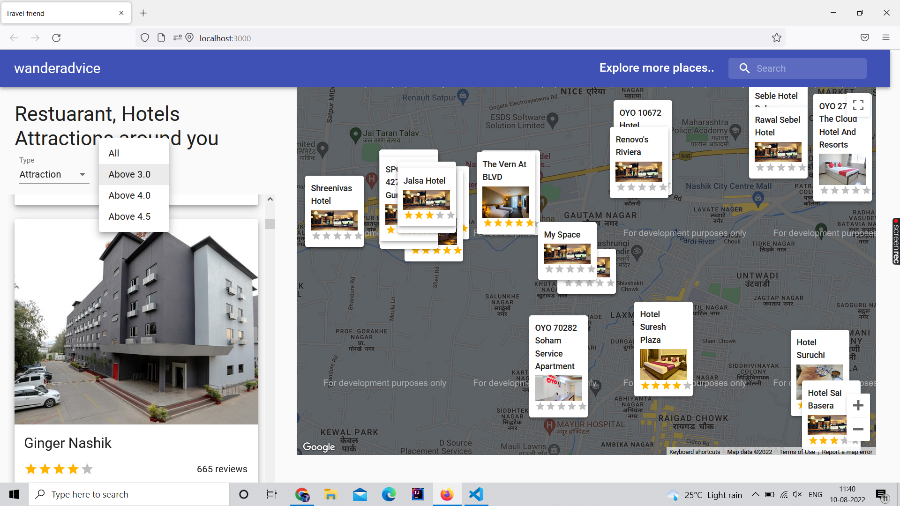

# Hotel Sugeestion

 # Introduction
 Build and Deploy an advanced Travel Companion Application using Google Maps. With Geolocation, Google Maps API, Searching for places, Fetching restaurants, hotels and attractions based on location from specialized Rapid APIs, data filtering

    Advanced React Best Practices such as folder & file structure, hooks and refs
    Creating a User Interface using Material UI
    Working with Google Maps API
    And most importantly fetching data from unlimited sources using RapidAPI
    Essentially, you'll become the master of working with APIs
